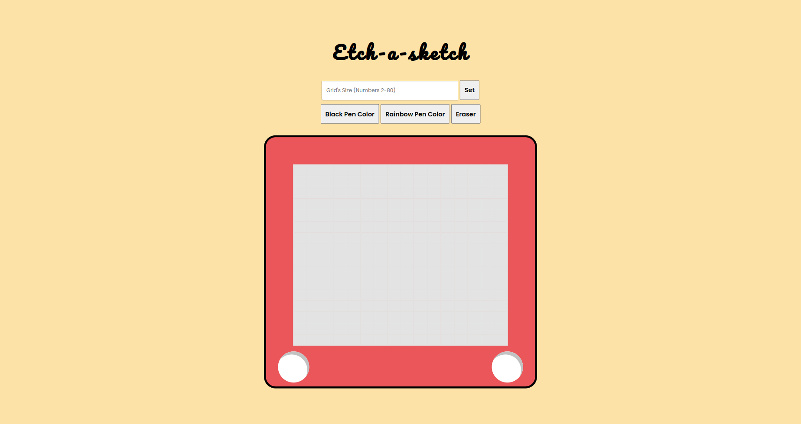

# Build an etch-a-sketch using HTML, SCSS and Vanilla Javascript
This is my solution to The Odin Projects' etch-a-sketch project. The aim of this project is to utilize what I've learned from the previous lessons regarding DOM manipulation. 

## This project runs a parcel sass bundler
To install:
#### Go to the main folder, then run this on the terminal
npm init -y
npm install sass -D
#### Go to the index.html file, then run this on the terminal
npm install parcel bundler -D
#### On the package.json file
{
 "main": "index.js",
  "targets": {
    "main": false
  },
  "scripts": {
    "start": "parcel src/index.html",
    "build": "parcel build src/index.html"
  }
}
#### Finally, to start the project
npm start

## Instruction
To start sketching, user must choose what pen to choose. The two given pens are "Black Pen Color" and "Rainbow Button". Choosing the black pen would let you sketch or fill each grid cells with a black color only, while the rainbow pen generates random colors and would let you sketch or fill each grid cells with random colors. The third button which is the "Eraser" would erase the colors on each grid's cell.

Users can also adjust the grid's size by typing a number (not lesser than 2 and greater than 80) on the text field and clicking the "Set" button.
